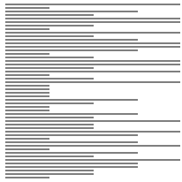
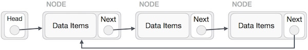
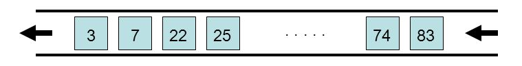
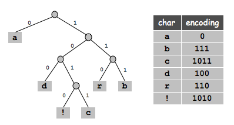
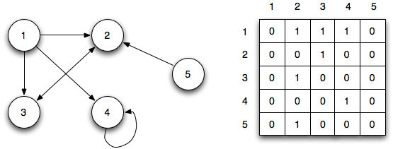
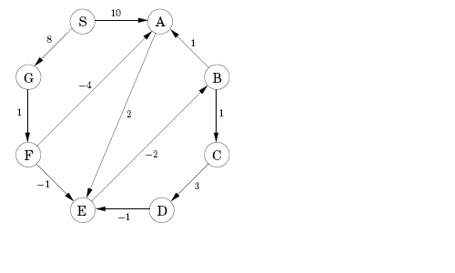
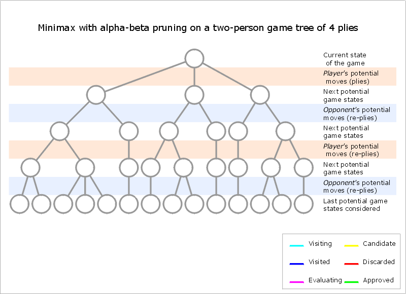
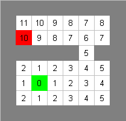

# `🏆 The Complete DSA Preparation 🏆`

This repository contains all the DSA (Data-Structures, Algorithms, 450 DSA by Love Babbar Bhaiya,STriver Series ,FAANG Questions and Many More)
The Programming languages used for demonstration are the C++, Python, and Java.

## `Table of Contents 📋`
| **SNo.** | **Contents** |
| -------  | ------------ |
| 1.       | [Data Structure](https://github.com/mrpawan-gupta/DSA-inNout/tree/main/1%5D.%20Data%20Structures) |
| 2.       | [Algorithms](https://github.com/mrpawan-gupta/DSA-inNout/tree/main/2%5D.%20Algorithms) |
| 3.       | [Love Babar DSA Sheet](https://github.com/mrpawan-gupta/DSA-inNout/tree/main/3%5D.%20Love%20Babbar%20DSA%20Sheet) |
| 4.       | [Striver Series](https://github.com/mrpawan-gupta/DSA-inNout/tree/main/4%5D.%20Striver%20Series) |
| 5.       | [CodeForces Series](https://github.com/mrpawan-gupta/DSA-inNout/tree/main/5%5D.%20CodeForces%20Series) |
| 6.       | [150 SDE Questions Leetcode]() |
| 7.       | [CompanyWise Questions](https://github.com/mrpawan-gupta/DSA-inNout/tree/main/7%5D.%20CompanyWise%20Questions) |
| 8.       | [Resources]() |

## Sorting

* [Bubble](),[Insertion](),[Selection](),[Merge]()

	
	
	
	

* [Shell](src/main/java/dsa/sort/ShellSort.java), [Heap](src/main/java/dsa/sort/HeapSort.java), [Quick](src/main/java/dsa/sort/QuickSort.java), [Radix](src/main/java/dsa/sort/RadixSort.java)

	
	
	

## Searching

* [Binary](https://github.com/mrpawan-gupta/DSA-inNout/blob/main/2%5D.%20Algorithms/01%5D.Searching%20Algorithms/C%2B%2B/_02%5D_Binary_Search.cpp), 
[Sequential](https://github.com/mrpawan-gupta/DSA-inNout/blob/main/2%5D.%20Algorithms/01%5D.Searching%20Algorithms/C%2B%2B/_01%5D_Linear_Search.cpp)

## Data Structure

1. Stack

	

2. Queue

	

	

3. LinkedList
	
	
	
	
		
	
	

4. Tree

	

	

	
	

5. Graph

	

	

	

	

	
